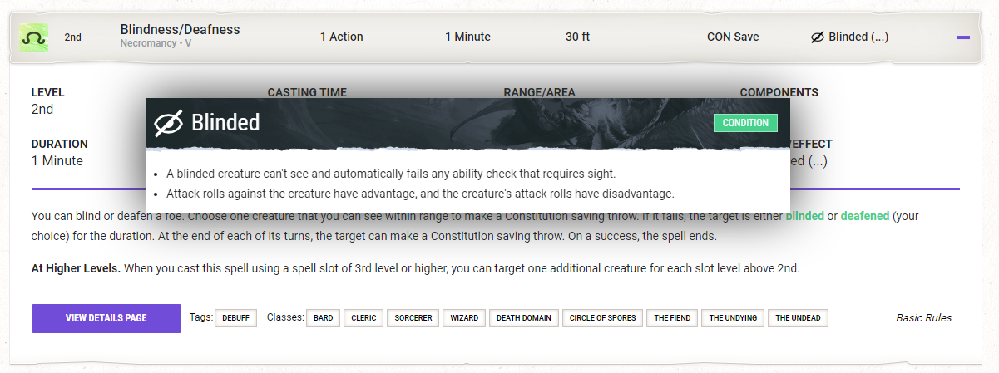

# Inline Text Reference

Some content benefits from letting users see a snippet or preview of another model, such as letting users see information about the condition that a spell will apply to its victim.

Syntax to enable this is as follows:

`[[ModelName:NameValue]]`

That would be inserted into the content of any relevant document, alongside its regular text. So for example:

```
"Most spells require the chanting of mystic words. The words themselves aren't the source of the spell's power; rather, the particular combination of sounds, with specific pitch and resonance, sets the threads of magic in motion. Thus, a character who is gagged or in an area of silence, such as one created by the [[Spell:Silence]] spell, can't cast a spell with a verbal component."
```

The text content above would show a differently-styled chunk of text for the word "Silence", indicating that it is a hoverable preview and clickable link.

- The frontend client must perform logic to find that Silence spell, build the hoverable preview, and create an appropriate clickable link.
- If the frontend client cannot find the Silence spell, it should fall back to showing the `NameValue` as-is, with styling that indicates that it's _meant_ to be something more but the system cannot find appropriate data.

Yes, this is very much like D&D Beyond's system - it's extremely good UX! We should absolutely have that as part of Sourcepool too.

